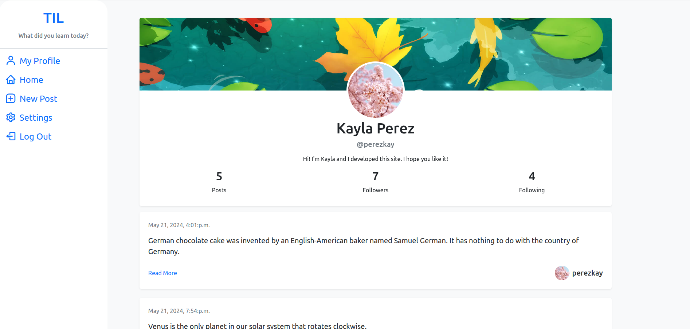
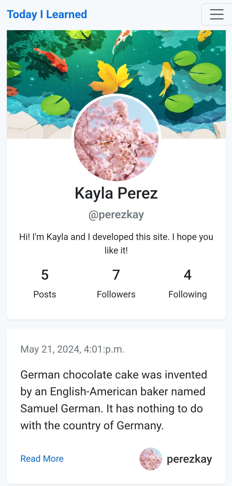

# Today I Learned

### _What did you learn today?_

A small, responsive social media style site for sharing fun facts that you learned during the day.

Users can create an account, edit their profile, follow and unfollow other users, and most importantly: post their fun facts.

## Built with:

- Django 5.0.4
- Python 3.12.3
- JavaScript
- Bootstrap 5
- HTML

## Screenshots
## Desktop
Current User's Profile

Homepage

User's Profile Settings

Other User's Profile

### Mobile
    
